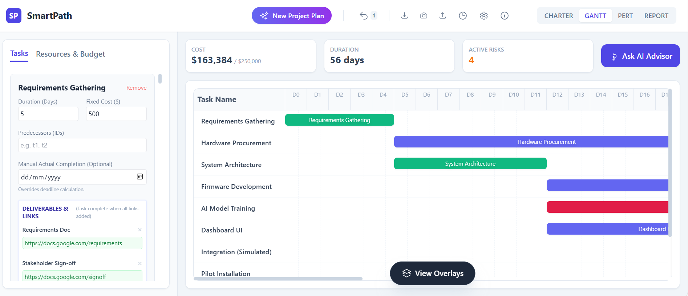
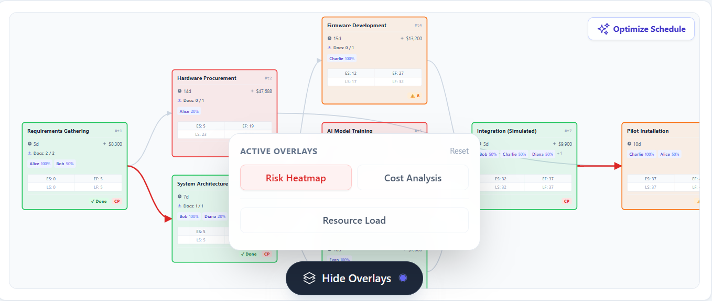
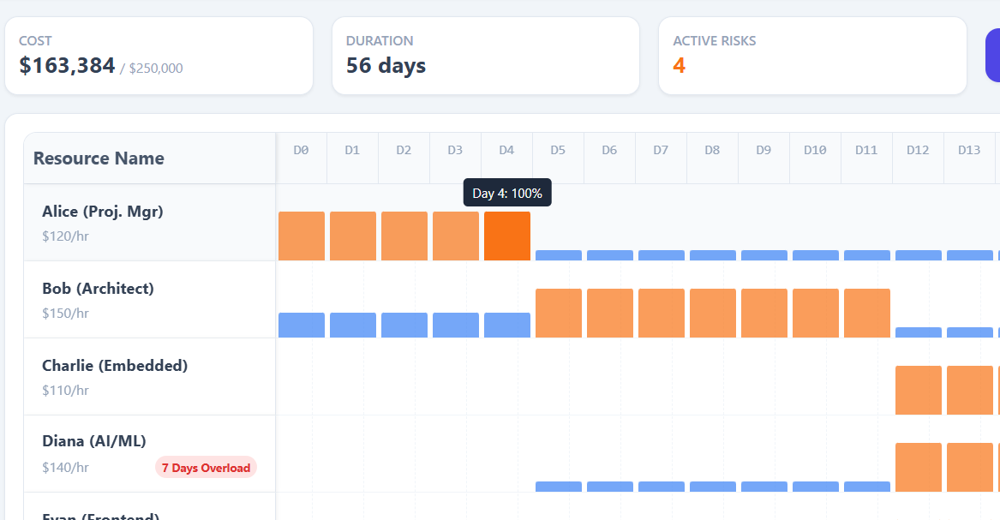
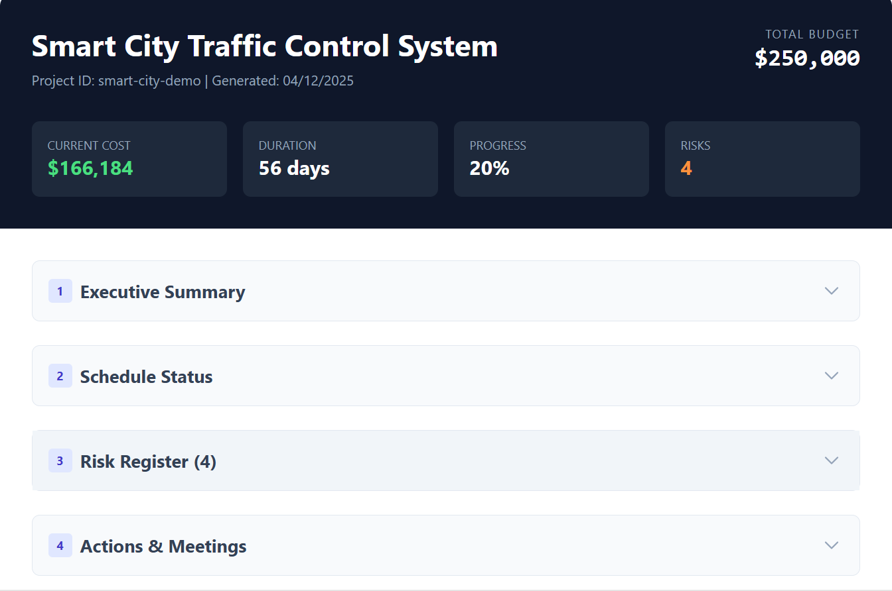
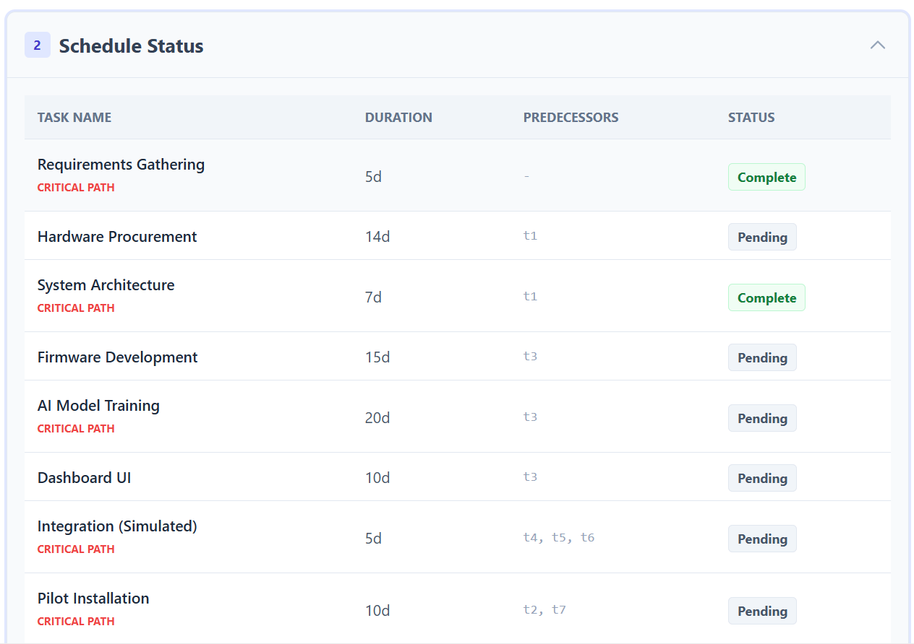
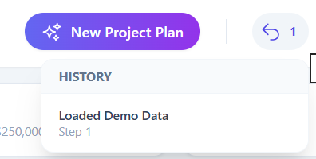
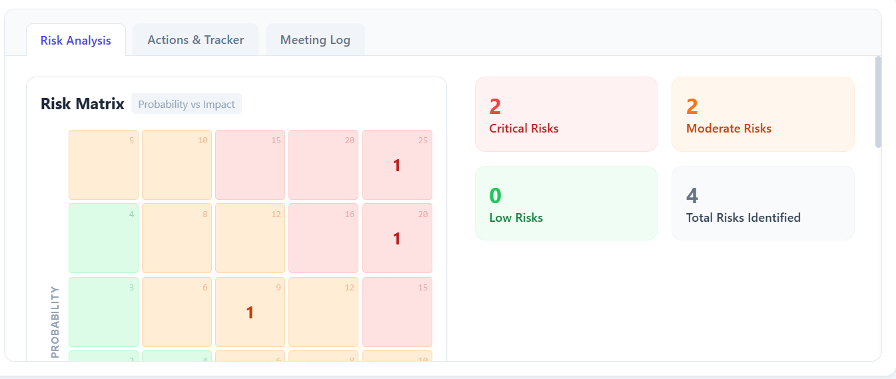
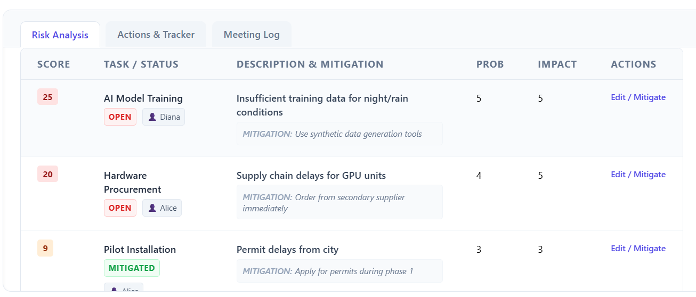
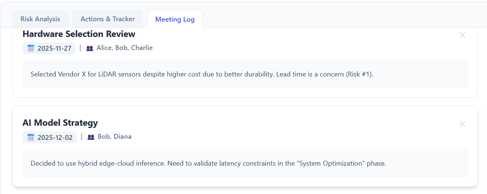
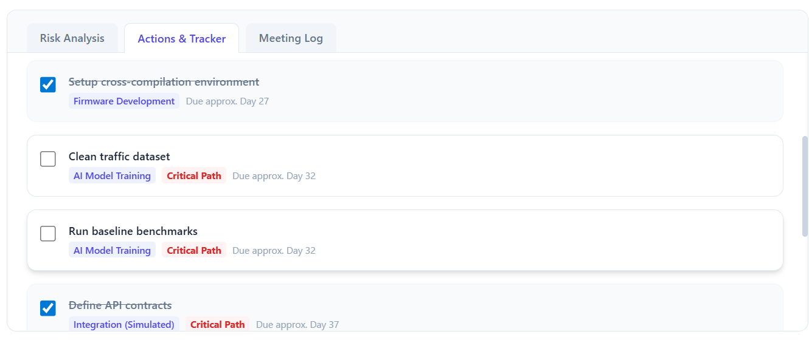

# SmartPath AI - Project Manager

**Next-Gen Project Management Suite powered by Generative AI.**

SmartPath AI combines traditional methodologies with Generative AI to help you plan, visualize, and optimize complex projects. Beyond simple scheduling, it provides deep financial tracking, risk lifecycle management, and a context-aware AI Advisor.

---

## 📸 Interface Gallery

### 1. Interactive Dual-View Visualization
Switch instantly between **Gantt Charts** for timeline planning and **PERT Charts** (Network Diagram) for dependency analysis. Both views support drag-to-pan, zoom, and interactive task editing.

<p align="center">
  
  <br>
  <em>Interactive Gantt Chart showing Critical Path and Task Progress</em>
</p>

<p align="center">
  
  <br>
  <em>Network Diagram (PERT) visualizing dependencies and flow</em>
</p>

### 2. Resource Intelligence
The dedicated **Resource View** highlights daily allocation percentages across all staff, instantly flagging bottlenecks and overloads.

<p align="center">
  
</p>

### 3. Comprehensive Reporting
Generate standalone **HTML Status Reports** with executive summaries, schedules, and risk registers—perfect for stakeholder updates.

<p align="center" style="display: flex; gap: 10px; justify-content: center;">
  
  
</p>

### 4. Project Governance & History
Define high-level goals, scope, and stakeholders in the **Project Charter**. Mistakes are easily fixed with the **Time Travel** history stack, allowing you to rollback the project state up to 10 steps.

<p align="center">
  
</p>

<p align="center">
  
  <br>
  <em>Visual Undo/Redo History Stack</em>
</p>

### 5. Risk Management
Identify, assess, and mitigate risks. The **Risk Matrix** automatically visualizes probability vs. impact, while the **Risk Register** tracks mitigation status.

<p align="center" style="display: flex; gap: 10px; justify-content: center;">
  
  
</p>

### 6. Tracking & Logs
Keep track of **Meeting Minutes** and **Action Items**. The AI Advisor can even analyze these logs to find gaps or suggest "What-If" scenarios.

<p align="center" style="display: flex; gap: 10px; justify-content: center;">
  
  
</p>

### 7. AI Intelligence
The **AI Advisor** provides context-aware insights. Whether you are optimizing a schedule, reviewing a charter, or analyzing risks, the AI acts as a senior consultant.

<p align="center">
  
</p>

---

## 🚀 Key Features

### 🧠 AI Planning & Advisory
-   **Generative Planning**: Describe your project in plain text or upload a document (`.md`, `.txt`, `.docx`), and the AI generates a complete schedule with tasks, dependencies, resources, and initial risks.
-   **Context-Aware Advisor**: Ask the AI for specific help depending on your current view (Optimization, Risk, Meetings, Charter).
-   **Query Log**: All AI interactions are saved in a history log for future reference.

### 📊 Interactive Visualizations
-   **Critical Path Method (CPM)**: Automatic calculation of early/late starts, slack time, and the critical path.
-   **Smart Overlays**: Toggle dynamic layers on your charts:
    -   **Risk Heatmap**: Color-codes tasks based on risk probability × impact.
    -   **Cost Intensity**: Visualizes high-cost nodes relative to the budget.
    -   **Resource Load**: Highlights over-allocated resources.
-   **Task Detail Modal**: Secure task inspection with an unlock-to-edit mechanism to prevent accidental changes.

### 💰 Financial & Resource Management
-   **Detailed Budgeting**: Track fixed costs per task and hourly resource rates.
-   **Budget Change Log**: Manage the total budget with a mandatory audit trail (reasoning/history) for any increases or decreases.
-   **Real-time Costing**: Live calculation of projected costs vs. total budget.
-   **Resource Heatmap**: Dedicated tab to view daily resource utilization across the entire project lifecycle.

### 📤 Reporting & Exports
-   **HTML Reports**: One-click generation of a standalone, interactive HTML status report containing executive summaries, risk registers, and schedules.
-   **JSON Import/Export**: Full state serialization.
-   **PNG Export**: High-resolution image capture of charts.

## Installation & Running Locally

1.  **Clone the repository**:
    ```bash
    git clone https://github.com/your-username/smartpath-ai.git
    cd smartpath-ai
    ```

2.  **Install dependencies**:
    ```bash
    npm install
    ```

3.  **Set up API Key**:
    This project uses Google's Gemini API. You need to set your API key in the environment variables or pass it during the build process.
    
    *Note: In the demo environment, the API key is automatically handled via `process.env.API_KEY`.*

4.  **Run the app**:
    ```bash
    npm start
    ```

## Tech Stack

-   **Frontend**: React, TypeScript, Tailwind CSS
-   **Visualization**: D3.js (PERT), Custom SVG/React (Gantt)
-   **AI**: Google GenAI SDK (Gemini 2.5 Flash)
-   **Utilities**: Mammoth.js (Docx parsing), html2canvas (Image export)
